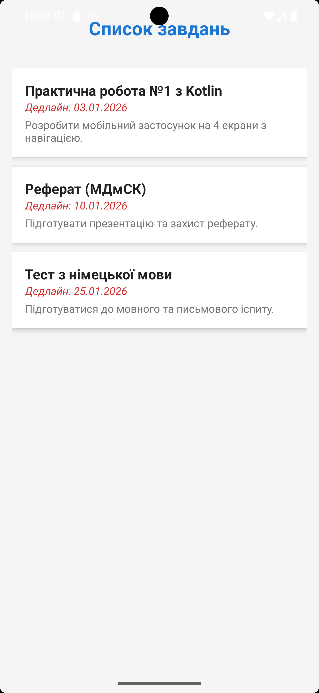
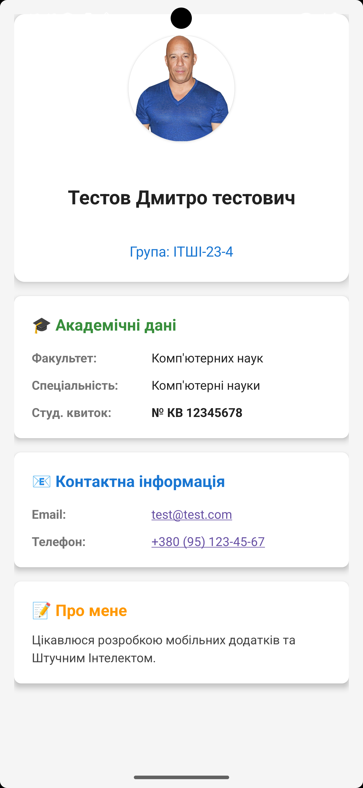
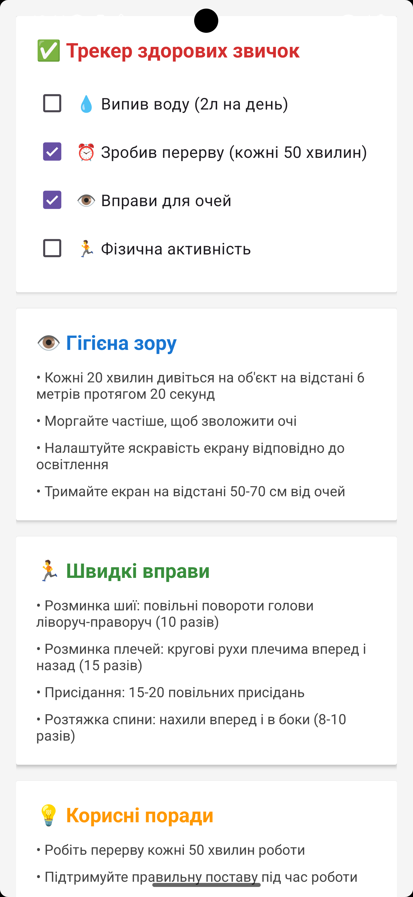
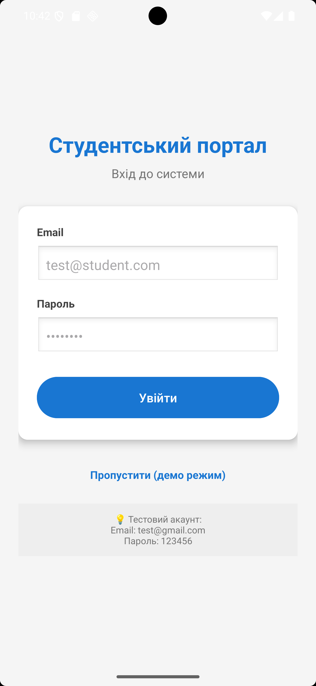

# 📱 Студентський міні-портал (Student Portal)

> Мобільний додаток для організації навчального процесу студентів з інтеграцією Firebase

[](https://developer.android.com)
[](https://kotlinlang.org)
[](https://firebase.google.com)
[](LICENSE)


## 🎯 Про проєкт

**Студентський міні-портал** — це Android-застосунок, розроблений для допомоги студентам у організації навчального процесу. Додаток дозволяє керувати завданнями, переглядати профіль студента та відстежувати здорові звички під час навчання.

### Основна мета

Створити зручний інструмент для студентів, який допоможе:
- 📚 Відстежувати академічні завдання та дедлайни
- 👤 Зберігати персональну інформацію студента
- 💪 Підтримувати здорові звички під час роботи за комп'ютером

---

## ✨ Функціонал

### 🏠 Головний екран (Home)
- Привітальне повідомлення
- Навігація до всіх розділів додатку
- Сучасний Material Design інтерфейс

### 📋 Завдання та дедлайни (Tasks)
- Відображення списку академічних завдань
- Позначення завдань як виконаних

### 👤 Профіль студента (Profile)
- Фотографія студента
- Персональна інформація:
  - ПІБ
  - Група та спеціальність
  - Факультет
  - Email та телефон
  - Номер студентського квитка
- Розділ "Про мене" з інтересами та навичками
- Завантаження даних з Firebase Firestore

### 💪 Здоров'я та фокус (Health)
- Трекер здорових звичок з чекбоксами:
  - 💧 Споживання води
  - ⏰ Перерви в роботі
  - 👁️ Вправи для очей
  - 🏃 Фізична активність
- Поради для гігієни зору
- Швидкі фізичні вправи
- Корисні поради для продуктивності

### 🔐 Автентифікація
- Вхід через Firebase Authentication (Email/Password)
- Демо-режим без авторизації
- Захист даних на рівні Firestore Security Rules

---

## 🛠 Технології

### Frontend
- **Kotlin** - основна мова програмування
- **Android SDK** - розробка під Android
- **Material Design 3** - сучасний UI/UX

### Backend
- **Firebase Authentication** - автентифікація користувачів
- **Firebase Firestore** - NoSQL база даних

### Архітектурні компоненти
- **Activity** - екрани додатку
- **Custom Adapters** - адаптери для списків
- **Data Classes** - моделі даних

### Інструменти розробки
- **Android Studio** - IDE
- **Gradle** - система збірки
- **Git** - контроль версій
- **Firebase Console** - управління backend

---

## 📥 Встановлення

### Передумови

Переконайтесь, що у вас встановлено:
- [Android Studio](https://developer.android.com/studio) (остання версія)
- [Git](https://git-scm.com/)
- JDK 11 або вище
- Android SDK (API 26+)

### Крок 1: Клонування репозиторію

```bash
git clone https://github.com/YOUR_USERNAME/StudentPortal.git
cd StudentPortal
```

### Крок 2: Відкриття проєкту

1. Відкрийте Android Studio
2. **File → Open**
3. Оберіть папку `StudentPortal`
4. Дочекайтесь завершення Gradle Sync

### Крок 3: Налаштування Firebase

1. Створіть проєкт у [Firebase Console](https://console.firebase.google.com/)
2. Додайте Android app з package name `com.example.studentportal`
3. Завантажте `google-services.json`
4. Помістіть файл у папку `app/`
5. Увімкніть Authentication (Email/Password)
6. Створіть Firestore Database (test mode)

### Крок 4: Запуск

1. Створіть емулятор або підключіть фізичний пристрій
2. Натисніть **Run** (▶️) або `Shift+F10`
3. Дочекайтесь встановлення застосунку

### Крок 5: Створення тестових даних

Див. документацію в репозиторії: `docs/FIREBASE_SETUP.md`

---

## 🏗 Архітектура

### Структура проєкту

```
StudentPortal/
├── app/
│   ├── src/
│   │   ├── main/
│   │   │   ├── java/com/example/studentportal/
│   │   │   │   ├── MainActivity.kt          # Точка входу
│   │   │   │   ├── AuthActivity.kt          # Автентифікація
│   │   │   │   ├── HomeActivity.kt          # Головний екран
│   │   │   │   ├── TasksActivity.kt         # Список завдань
│   │   │   │   ├── ProfileActivity.kt       # Профіль
│   │   │   │   ├── HealthActivity.kt        # Здоров'я
│   │   │   │   └── StudentProfile.kt        # Модель профілю
│   │   │   ├── res/
│   │   │   │   ├── layout/                  # XML розмітка
│   │   │   │   ├── drawable/                # Зображення
│   │   │   │   └── values/                  # Ресурси
│   │   │   └── AndroidManifest.xml
│   │   └── google-services.json             # Firebase config
│   └── build.gradle.kts
├── build.gradle.kts
├── README.md
├── LICENSE
└── .gitignore
```

### Діаграма навігації

```
MainActivity (Splash)
    ↓
AuthActivity (Login)
    ↓
HomeActivity (Menu)
    ├── TasksActivity (Завдання)
    ├── ProfileActivity (Профіль)
    └── HealthActivity (Здоров'я)
```

### Firebase структура

#### Firestore Collections

```
/users/{userId}
    - fullName: string
    - group: string
    - specialty: string
    - email: string
    - studentId: string
    - aboutMe: string
    - phoneNumber: string
    - courseYear: number
    - faculty: string
    - photoUrl: string (optional)

```

---

## 📸 Скріншоти


### Головний екран


### Список завдань


### Профіль студента


### Здоров'я та фокус


### Автентифікація


---

## 🔥 Firebase налаштування

### Authentication

1. Firebase Console → **Authentication**
2. **Sign-in method** → Увімкніть Email/Password
3. Створіть тестового користувача

### Firestore Database

1. Firebase Console → **Firestore Database**
2. **Create database** → Test mode
3. Створіть колекції `users` та `tasks`

### Security Rules

```javascript
rules_version = '2';
service cloud.firestore {
  match /databases/{database}/documents {
    match /users/{userId} {
      allow read, write: if request.auth != null && request.auth.uid == userId;
    }
    
    match /tasks/{taskId} {
      allow read: if request.auth != null && resource.data.userId == request.auth.uid;
      allow create: if request.auth != null && request.resource.data.userId == request.auth.uid;
      allow update, delete: if request.auth != null && resource.data.userId == request.auth.uid;
    }
  }
}
```

---

## 💻 Використання

### Демо-режим

Для швидкого тестування без авторизації:
1. Запустіть застосунок
2. Натисніть **"Пропустити (демо режим)"**
3. Відобразяться локальні дані

### З авторизацією

**Тестовий акаунт:**
- Email: `test@gmail.com`
- Пароль: `123456`

### Додавання завдань у Firestore

```bash
# Через Firebase Console
1. Firestore Database → tasks → Add document
2. Заповніть поля згідно структури
3. userId = ваш User UID з Authentication
```

---

## 🚀 Розробка

### Вимоги для розробників

- Kotlin 2.0+
- Gradle 8.13+
- Android SDK 26-36
- Firebase SDK 33.7.0

### Запуск у режимі розробки

```bash
# Клонування
git clone https://github.com/YOUR_USERNAME/StudentPortal.git

# Відкриття в Android Studio
# File → Open → StudentPortal

# Gradle Sync
./gradlew clean build

# Запуск тестів
./gradlew test
```

## 🤝 Contribution

Будемо раді вашому внеску! Дивіться [CONTRIBUTING.md](CONTRIBUTING.md) для деталей.

### Як зробити внесок

1. Fork репозиторію
2. Створіть гілку (`git checkout -b feature/AmazingFeature`)
3. Commit зміни (`git commit -m 'Add some AmazingFeature'`)
4. Push до гілки (`git push origin feature/AmazingFeature`)
5. Відкрийте Pull Request

---

## 👨‍💻 Автор

**Василець Дмитро**
- Email: dmytro.vasylets@nure.ua
- Університет: Харківський національний університет радіоелектроніки
- Група: ІТШІ-23-4
- Факультет: Комп'ютерних наук

---

## 📄 Ліцензія

Цей проєкт ліцензовано під MIT License - дивіться файл [LICENSE](LICENSE) для деталей.
